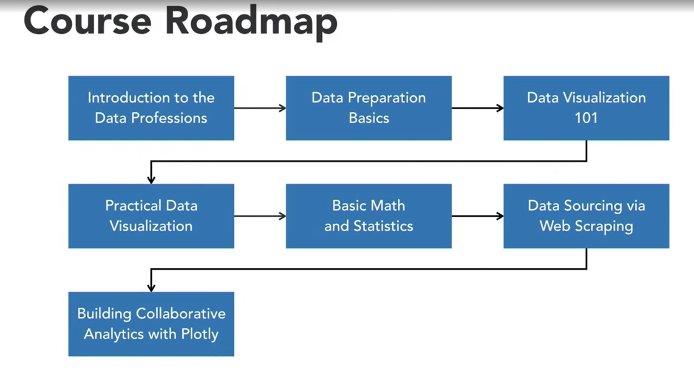

# Introduction to the data professions
## 1. Introduction to the data professions
* Data Science
    * Data science is a systematic study of the structure and behavior of data in order to quantifiably understand past and current occurrences, as well as to predict the future behavior of data.
    * Data scientists derive insights from data, including big data (data from data engineered systems).
    * Data Scientist: Typical Competencies
        * STEM degree, with advanced math.
        * Coding: Python, R, SQL, Spark, machine learning.
* Data Engineering 
    * Data Engineering is the design, construction and maintence of data systems.
    * Data Engineer: Typical Competencies
        * Computer science, software engineering.
        * Coding: Java, C++, Python
* Data Analytics
    * Data analytics are data products that describe data and how it behaves. So, these data products are generated from data analysis and visualization processes.
    * Analytics Specialist: Typical Competencies
        * Use applications to analyze data.
        * Solid in basic math.
        * Understand the inner workings of business very well.
        * Enjoy using data insights to improve business.
        * Not into deep analysis.

## 2. The four flavors of data analysis
* Data analysis
    * Data analysis is a process for making sense of data.
    * Data analysis could include data cleaning, reformatting, and recombining data
    * Data analysis is carried out with the express intention of discovering trends, patterns, and findings in data that describe real-life phenomenon.
* Data science
    * Data science is a systematic study of the structure and behavior of data in order to quantifiably understand past and current occurrences, as well as to predict the future behavior of data.
* Artificial intelligence
    * A machine or application with the capacity to autonomously execute upon prediction it makes from data.
        1. **Prediction** - predictive modelling (from data science).
        2. **Execution** - autnomous response (from engineering).
* Deep learning
    * Deep learning is a set of predictive methodologies that borrows its structure from the neural network structures of the brain. This class of methods is particulary effective for making predictions from big data.
    * Deep learning is a sub-field within data science, and it can be used as a decision model with applications to produce deep learning AI.

## 3. Why use Python for analytics?
* Coding Languages for Data Science:
    * Python
    * R
    * Julia
    * Go
* Python is a high-level, interpreted coding language that is useful for a very wide variety of applications.
* Python is one of the official programming languages of Google.
* Benefits of Using Python:
    * Easy to learn, human readable.
    * Extensive array of well-supported data science libraries.
    * Biggest user base of all data science languages.
    * Useful in data engineering.
* Python is useful for:
    * Data science, data analytics and data engineering.
    * Useful in both a professional and an academic environment.
    * Python is an open-source programming language.
    * Web development.
    * Applicaiton development.
    * Game development.
* Main Python libraries for Data Science:

    Advanced Data Analytics | Data Visualization | Machine Learning
    ------------------------|--------------------|-----------------
    Numby SciPy pandas | Matplotlib Seaborn | scikit-learn TensorFlow Keras

## 4. High-level course road map

[<<Previous](../README.md) | [Next>>](../unit02-Data%20Preparation%20Basics/README.md)