# Data Visualization 101
## 1. The three types of data visualization
* Three Different Data Visualization Types
    1. **Data storytelling** - for presentation to organizational decision makers.
    2. **Data showcasing** - for presentation to analysts, scientists, mathematicians, and engineers.
    3. **Data art** - for presentation to activists or to the general public.

### Data storytelling
* The purpose of **Data storytelling** is to make it easy for the audience to get the point.
    * You want them to understand that point within the first 10 to 15 seconds of looking at you graphic.
    * If they will have to be looking more than that, then you're going to lose their attention.
* For these reasons, your data visualization should be:
    * Clutter-free.
    * Highly focused/organized.
* Intended audience:
    * Nonanalysts.
    * Nontechnical business managers.
* Product types:
    * Static images.
    * Simple interactive dashboards.
* In this course, we are going to use Python libarary [Plotly](https://plotly.com/python/) to create interactive data visualization.
* Example:
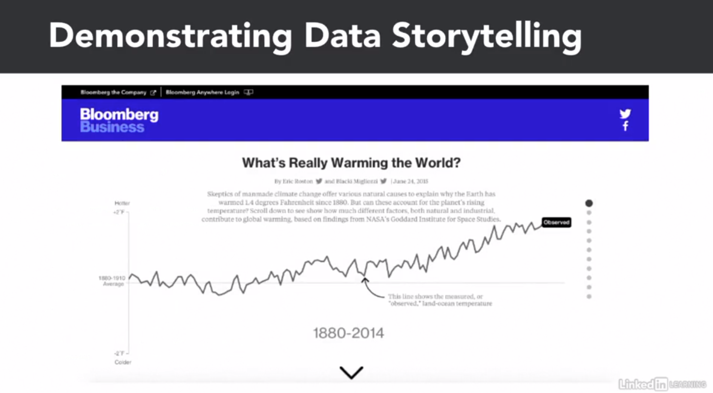

### Data showcasing
* Showcase lots of data so your audience members can think for themselves.
    * This a direct oppsition to [Data storytelling](#data-storytelling)
    * [Data storytelling](#data-storytelling) is where you present your findings in very, very clear and easy-to-understand way.
    * In data showcasing, the audience is looking to draw their own conclusions.
* Your data visualization should be:
    * Highly contextual:
        * Include all sorts of background information to help the audience to draw thei own conclusions.
    * Open ended:
        * Not telling the audience your findings but allowing them to think for themselves.
* Intended audience:
    * Analysts, quants.
    * Engineers, mathematicians, scientists
    * Basically people with analytical mindset, background.
* Product types:
    * Static images.
    * Interactive dashboards.
* Example:
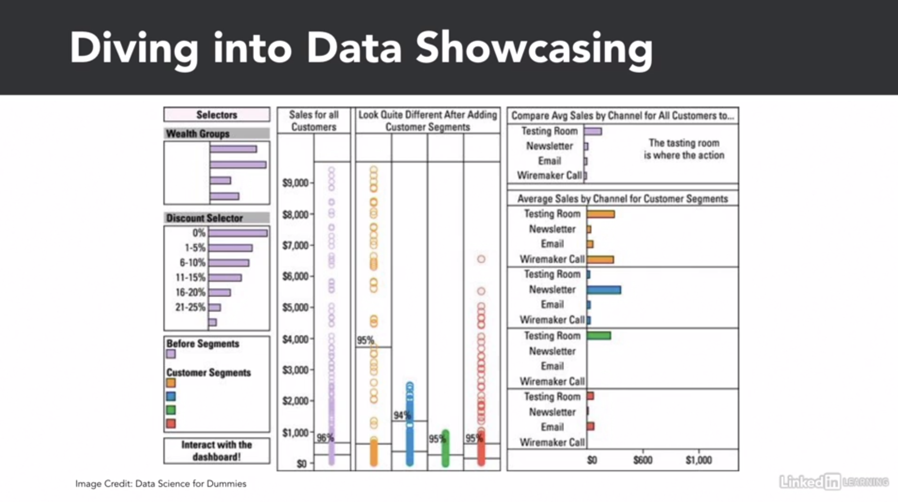

### Data Art
* Use your data visualization to make a statement.
    * Used in something like data journalism or to get the public to take an action.
* Your data visualization should be:
    * Attention getting.
    * Creative, controversial.
* Intended audience:
    * Idealists, dreamers, artists.
    * Social activists.
* Product Types:
    * Static images.
* Example:
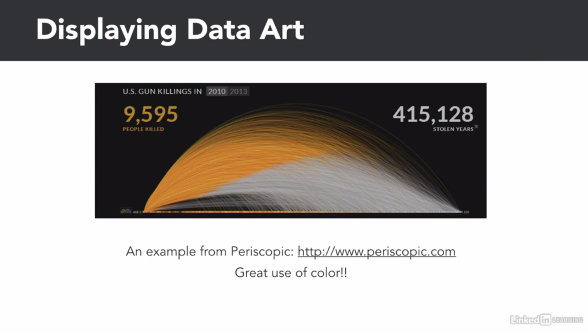

## 2. Selecting optimal data graphics
* Choosing data graphics is depending on the data visualization you're creating.

### Data Storytelling Griphics Types
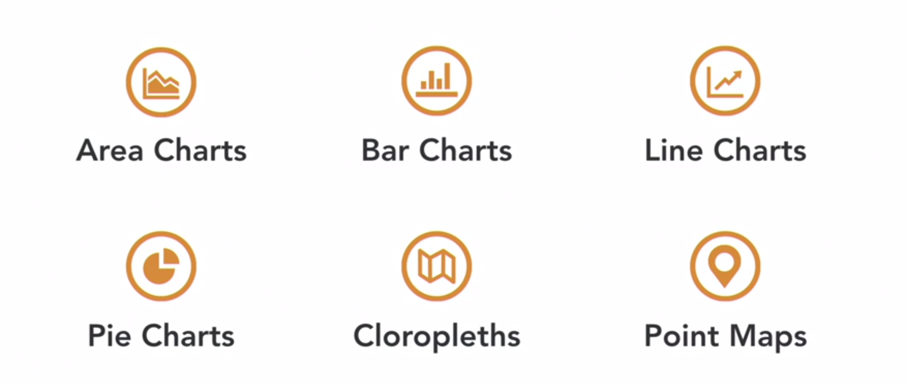
* For [Data Storytelling](#data-storytelling), appropiate grapics would be something like:
    * **Pie chart**.
    * **Line chart**.
    * **Bar chart**.
    * **Area chart**.
    * **Point map**: it's a map that has interesting points (i.e. _major cities_) are highlighted as points.
    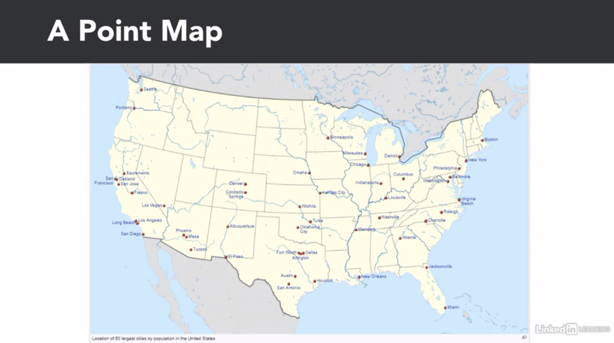
    * **Choroploths maps**: it's a map that shows area boundaries.
    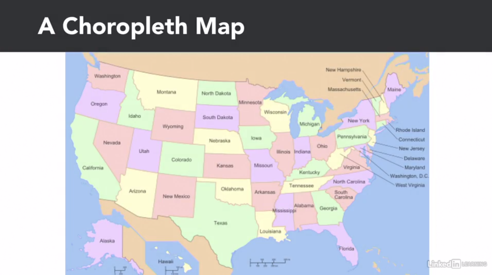
* These types of graphics are useful in Storytelling because understands what they mean.

### Data Showcasing Griphics Types
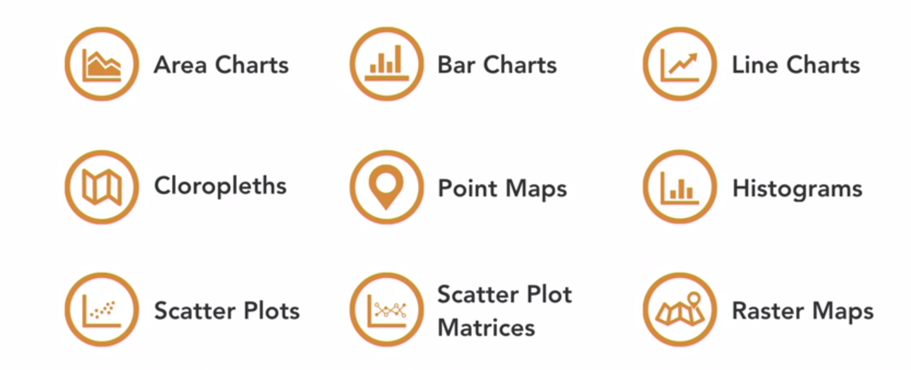
* We can use the same types as Data [Storytelling Graphics Types](#data-storytelling-griphics-types) plus:
    * **Histograms**.
    * **Scatter plots**.
    * **Scatter plots matrices**.
    * **Raster maps**: it's a raster file that's actually made up of an X and Y grid, which is filled with a variety of values. The XY grid is then filled with values that are colored according to count.
    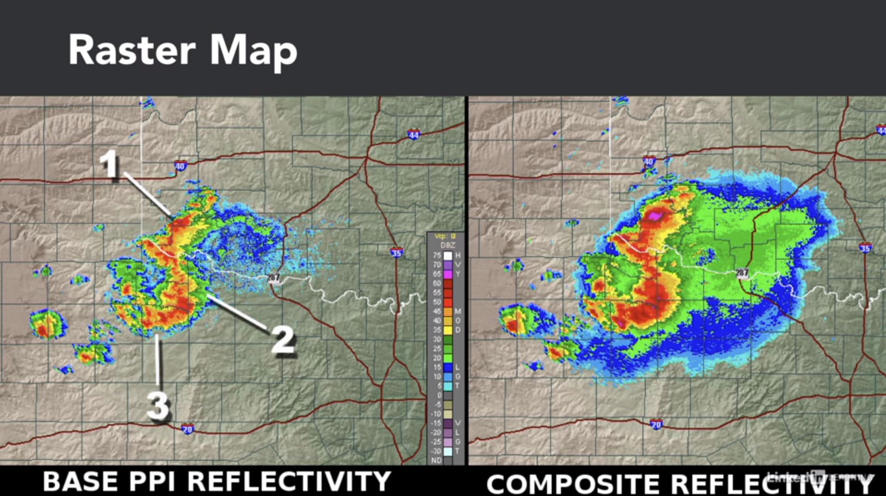

### Data Art Griphics Types
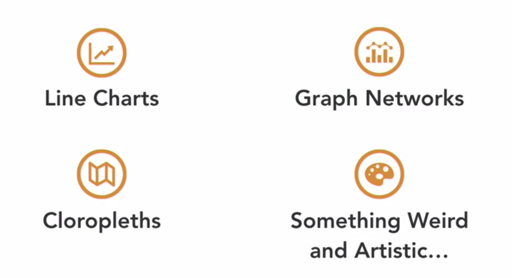
* Most of the time [Data Art](#data-art) is presened in an artistic way rather than known graphics type.
    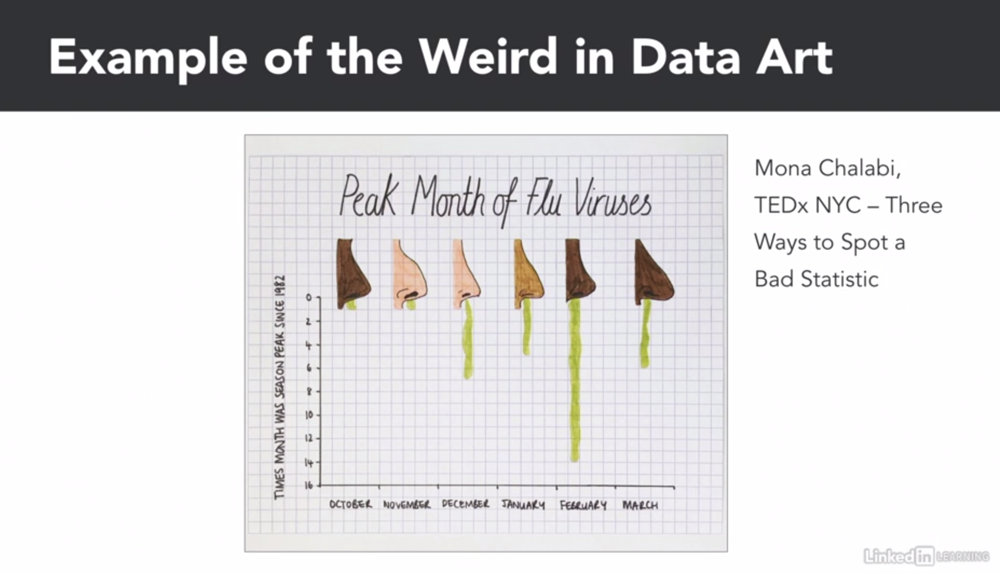

### Four Steps to Choosing Data Graphics
1. Make a list of questions that your data visualization is meant to answer.
2. Is your data visualization type [Data Storytelling](#data-storytelling), [Data Showcasing](#data-showcasing), or [Data Art](#data-art)?
    * This should be answered by thinking about intended audience who is going to be consuming this data visualization.
3. What data graphic types are preferable for that type of data visualization?
4. Test out different types of data graphics with your data. Which graphic type displays the most clear and obvious answers to your questions?

#### Testing Out Data Graphics
* The two data graphics below represent the same statistic. Notice how the data graphic on the right does a much better job of visually emphasizing the difference in values?
* You should always test different data graphics, to make sure that you use the one that most clearly and effectively displays your data. The graphic below and to the left is not effective.
    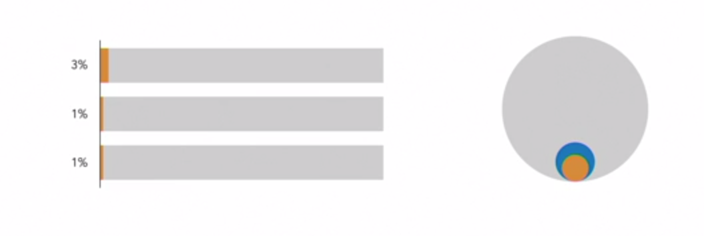

## 3. Communicating with color and context
### Creating Context with Color
* The correct choice of color and context can really add a lot of value to your data visualization.
* Color should be used:
    * Strategically.
    * Sparingly.
    * Consistently.
* **You want to use color to draw attention to the parts of the visualization that matter, and away from the parts that don't**.
* Your shades should all be from the same color formula. Options include (based on [Color Theory](https://en.wikipedia.org/wiki/Color_theory)):
    * Monochromatic.
    * Analogous.
    * Complimentary.
    * Split complimentary.
    * Triadic.
    * Tetradic.
* For a good tool to help find good color schemes to use in your data visualization, there's an AI-driven color-matching tool called [Colormind](http://colormind.io/).
     * All color schemes that are generated from [Colormind](http://colormind.io/) are within the same color formula.
### Annotations as Context
* Provide your audience some information about why data is as it is.
* Useful in [data storytelling](#data-storytelling) and [data showcasing](#data-showcasing) because they add that layer of context and meaning to the data visualization to help consumers understand what it is you're showing them.
    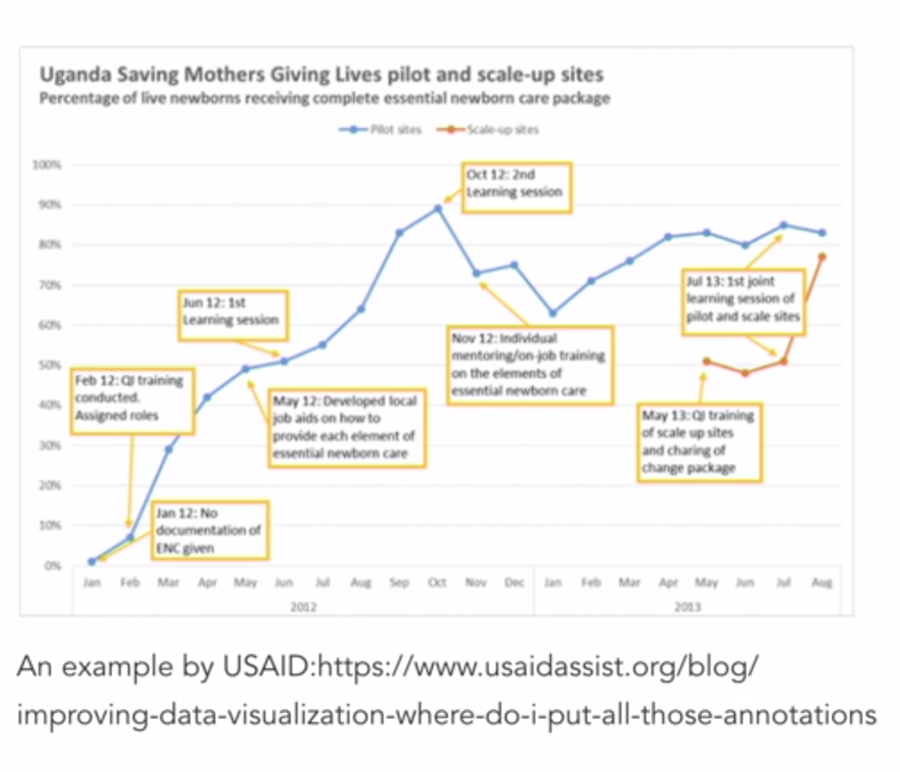
* Annotation as context are useful for providing your audience some information about why the data behaves as it does.

### Graphic Elements as Context
* Help your audience understand the relative significance of the data you're showing them.
* Trendlines, single-value alerts, and benchmarks.
    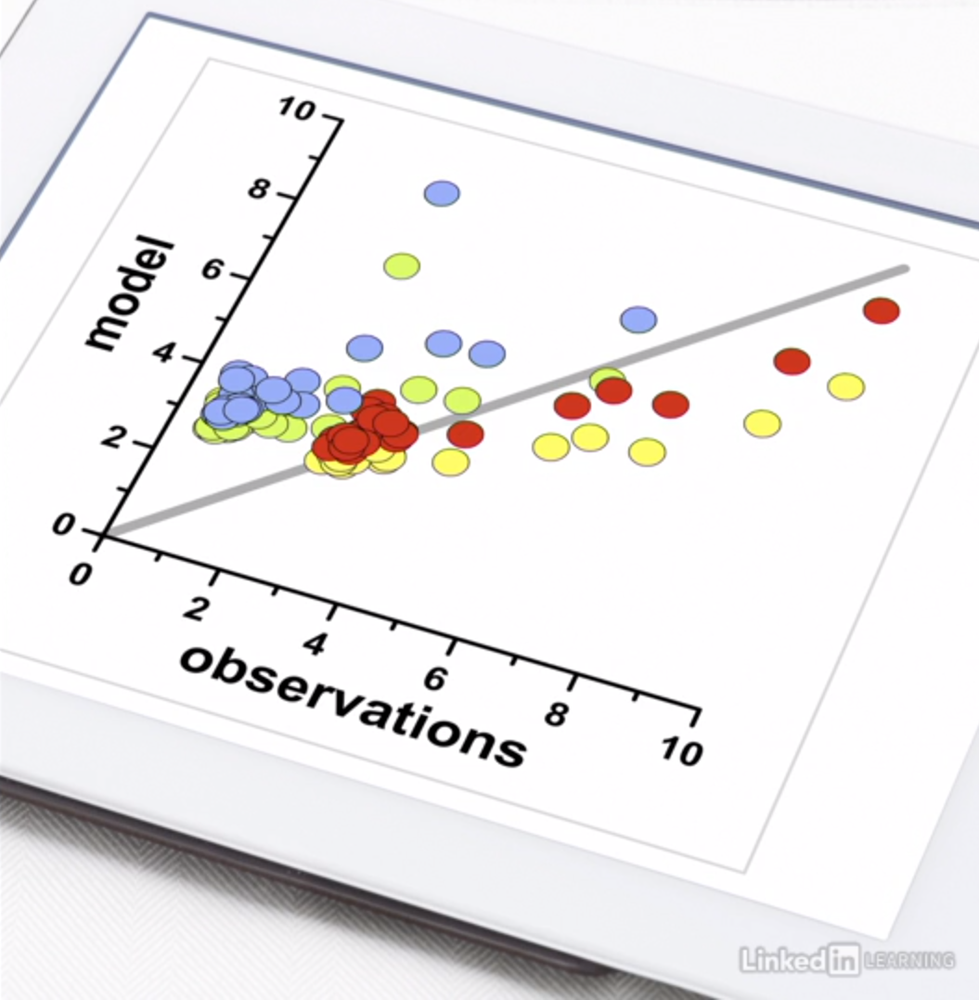

### Creating Context
* **How**: add data on additional metrics that are relevant to the datasets you're showing, trendlines, colors, and annotations.
* **Why**: meant to give audience so,e deeper perspective and insight into what's hapenning.
* **When**: useful in [data showcasing](#data-showcasing).
    * In [data showcasing](#data-showcasing) you would add just a little bit of textual context or maybe a trendline, something to explain or to clarify exactly what you're trying to tell your audience.
    * You would not expect the audience to go in and read multiple layers of annotation or to go into a deep dive evaluating the data visualization.

### Use of Color Example
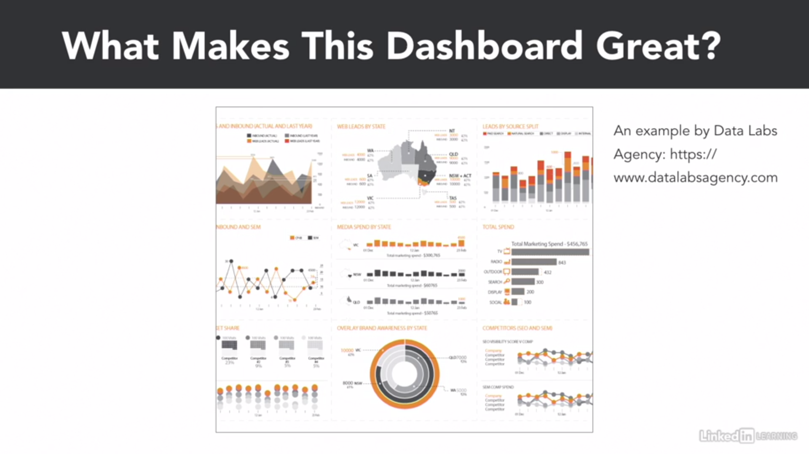
* It uses color to draw attention to what matters most in this piece.
* Uses muted shades in order to basically underline and support their data visualization for completeness.
* The red and orange really draw attention to the points that they are trying to make with the data visualization.
* The grey areas are there for completeness and support.

[<<Previous](../unit02-Data%20Preparation%20Basics/README.md) | [Next>>](../unit04-Practical%20Data%20Visualization/README.md)