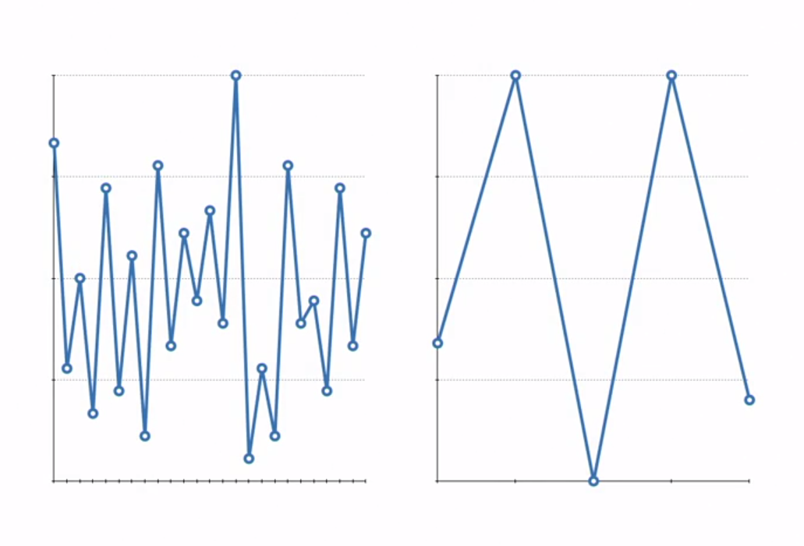

# Practical Data Visualization
## 1. Creating standard data graphics
Standard Chart Graphics are excellent tool for conveying simple data insights in a way that anyone can understand.
### Line Chart
* Show the change in value of an attribute with respect to a x-variable(which is often _time_).
* Can be used to visually compare the values of several related attributes.
* **Example**: show how the total number of items purchased per day has increased since the change

### Bar Chart
* Represent data attribute values within a particular data category by using bars of differing height.
* Bar charts represent observation counts within categories.
* **Example**: show that the number of purchases increased for customers in the 18 to 25 year old category, but decreased for customers in the higher than 44 year old category.

### Pie Chart
* Represents data attribute values using a circle and slices that comprise it.
* A whole and entire set of categorical data is represented by the complete circle, and the proportions of observations that fall into different categories are represented by proportionate pie slices.
* **Example**: you use a pie chart to show what categories of products generate the greatest proportion of sales, and how the site changes affected that proportion before and after.

**To summarize, you use**
* [**Line Chart**](#line-chart): To show changes overtime.
* [**Bar Chart**](#bar-chart): To show changes in categorical data.
* [**Pie Chart**](#pie-chart): To show categorical data as proportions of a whole.

### Plot Building
Two Methods for Plot Building:
#### Functional Method
With the _Functional Method_, you build plots by calling the plotting function on a variable or a set of variables.

#### Object-Oriented Method:
With object-oriented plotting, you build a plot by first generating a blank figure object and then populating that object with plot and plot element.

#### Popular Data Visualization Libraries in Python
* Matplotlib
* Seaborn

In the [Code Demonstration](./code/04-01.ipynb), we will use _Functional Method_ with _Matplotlib_

## 2. Defining elements of a plot
* Plot elements add context to your plot, so the plot effectively conveys meaning to its viewers.
    * You set axes limits to make sure that your chart is well fit to your data graphic.
    * You set axes tick marks and plot grids to make it easier and faster for the viewers to interpret your chart at a glance. 
    * You can use subplots to visually compare changes in data values under different conditions, like different seasons, different locations, or in different years.
* Adding plot elements is an essential part of [object oriented plotting](#object-oriented-method)
    * with object oriented plotting, you build a plot by first generating a blank figure object, and then populating that object with plots and plot elements.
### Steps in Object-Oriented Plotting
1. Create a blank figure object.
2. Add axes to the figure.
3. Generate plots(s) within figure object.
4. Specify plotting and layout parameters for the plots within your figure.

#### Subplots
A subplot is a plotting figure that contains more than one plot - or subplots.
